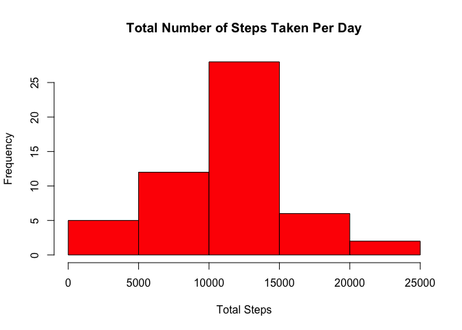
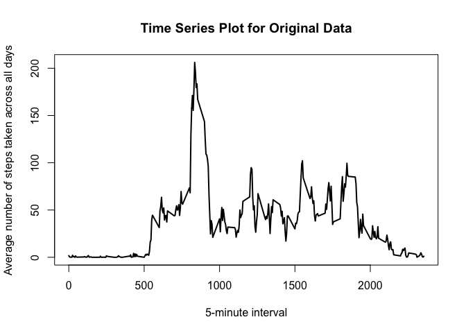
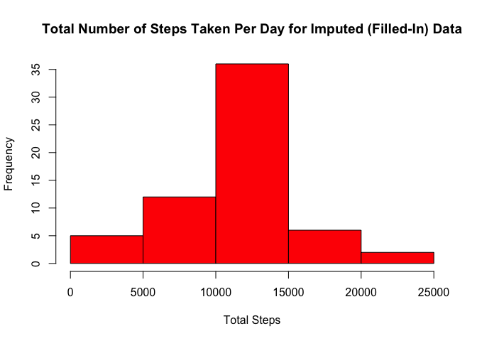
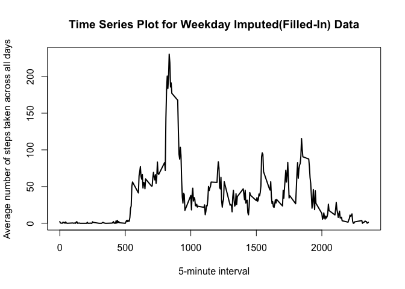
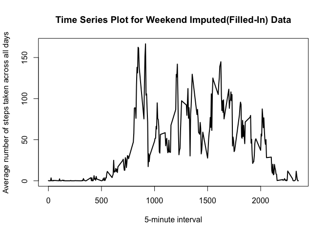

# Reproducible Research: Peer Assessment 1


## Loading and preprocessing the data

```r
library(dplyr)
```

```
## 
## Attaching package: 'dplyr'
```

```
## The following objects are masked from 'package:stats':
## 
##     filter, lag
```

```
## The following objects are masked from 'package:base':
## 
##     intersect, setdiff, setequal, union
```

```r
library(ggplot2)
setwd(
"/Users/abhishekdubey/abhishek-git-repos/datasciencecoursera/reproducible-research/RepData_PeerAssessment1"
)
activity <- read.csv(file = "activity.csv", header = TRUE, stringsAsFactors = FALSE, na.strings = "NA")
activity$date <- as.POSIXct(strptime(with(activity, date), "%Y-%m-%d"))
activityCompleteCases <- activity[complete.cases(activity),]
```

## What is mean total number of steps taken per day?

```r
activitySummary <- select(activityCompleteCases, date, steps) %>% group_by(date) %>% summarize(totalSteps = sum(steps), mean = mean(steps), median = median(steps))
hist(activitySummary$totalSteps, col = "red", xlab = "Total Steps", main = "Total Number of Steps Taken Per Day")
```

<!-- -->

**Mean and Median of total number of steps taken per day**

```r
print(select(activitySummary, date, mean, median, totalSteps), n = nrow(activitySummary))
```

```
## Source: local data frame [53 x 4]
## 
##          date       mean median totalSteps
##        <time>      <dbl>  <dbl>      <int>
## 1  2012-10-02  0.4375000      0        126
## 2  2012-10-03 39.4166667      0      11352
## 3  2012-10-04 42.0694444      0      12116
## 4  2012-10-05 46.1597222      0      13294
## 5  2012-10-06 53.5416667      0      15420
## 6  2012-10-07 38.2465278      0      11015
## 7  2012-10-09 44.4826389      0      12811
## 8  2012-10-10 34.3750000      0       9900
## 9  2012-10-11 35.7777778      0      10304
## 10 2012-10-12 60.3541667      0      17382
## 11 2012-10-13 43.1458333      0      12426
## 12 2012-10-14 52.4236111      0      15098
## 13 2012-10-15 35.2048611      0      10139
## 14 2012-10-16 52.3750000      0      15084
## 15 2012-10-17 46.7083333      0      13452
## 16 2012-10-18 34.9166667      0      10056
## 17 2012-10-19 41.0729167      0      11829
## 18 2012-10-20 36.0937500      0      10395
## 19 2012-10-21 30.6284722      0       8821
## 20 2012-10-22 46.7361111      0      13460
## 21 2012-10-23 30.9652778      0       8918
## 22 2012-10-24 29.0104167      0       8355
## 23 2012-10-25  8.6527778      0       2492
## 24 2012-10-26 23.5347222      0       6778
## 25 2012-10-27 35.1354167      0      10119
## 26 2012-10-28 39.7847222      0      11458
## 27 2012-10-29 17.4236111      0       5018
## 28 2012-10-30 34.0937500      0       9819
## 29 2012-10-31 53.5208333      0      15414
## 30 2012-11-02 36.8055556      0      10600
## 31 2012-11-03 36.7048611      0      10571
## 32 2012-11-05 36.2465278      0      10439
## 33 2012-11-06 28.9375000      0       8334
## 34 2012-11-07 44.7326389      0      12883
## 35 2012-11-08 11.1770833      0       3219
## 36 2012-11-11 43.7777778      0      12608
## 37 2012-11-12 37.3784722      0      10765
## 38 2012-11-13 25.4722222      0       7336
## 39 2012-11-15  0.1423611      0         41
## 40 2012-11-16 18.8923611      0       5441
## 41 2012-11-17 49.7881944      0      14339
## 42 2012-11-18 52.4652778      0      15110
## 43 2012-11-19 30.6979167      0       8841
## 44 2012-11-20 15.5277778      0       4472
## 45 2012-11-21 44.3993056      0      12787
## 46 2012-11-22 70.9270833      0      20427
## 47 2012-11-23 73.5902778      0      21194
## 48 2012-11-24 50.2708333      0      14478
## 49 2012-11-25 41.0902778      0      11834
## 50 2012-11-26 38.7569444      0      11162
## 51 2012-11-27 47.3819444      0      13646
## 52 2012-11-28 35.3576389      0      10183
## 53 2012-11-29 24.4687500      0       7047
```


## What is the average daily activity pattern?

```r
activitySummaryByInterval <- select(activityCompleteCases, interval, steps) %>% group_by(interval) %>% summarize(mean = mean(steps))
plot(activitySummaryByInterval$interval, activitySummaryByInterval$mean, type = "l", lwd = 2, xlab = "5-minute interval", ylab = "Average number of steps taken across all days", main = "Time Series Plot for Original Data")
```

<!-- -->

```r
activity.maxSteps <- filter(activityCompleteCases, steps == max(steps))
```


```
## [1] "The 5-minute interval, on average across all the days in the dataset, which contains the maximum number of steps is as following: "
```

```
##   steps       date interval
## 1   806 2012-11-27      615
```

## Imputing missing values

```
## [1] "Total number of missing values in the dataset = 2304"
```

**We will be using "mean for that 5-minute interval" for imputing(filling-in) missing steps data. In below code, "activity.imputed.data" is the new dataset that is equal to the original dataset but with the missing data filled in.**

```r
activity.missing.data.rows <- activity[which(is.na(activity$steps)), ]
activity.not.missing.data.rows <- activity[which(!is.na(activity$steps)), ]
activity.missing.data.rows$steps <- activitySummaryByInterval$mean[match(activitySummaryByInterval$interval, activity.missing.data.rows$interval, nomatch = 0)]

activity.imputed.data <- arrange(rbind(activity.missing.data.rows,activity.not.missing.data.rows), date, interval)
activity.summary.for.imputed.data <- select(activity.imputed.data, date, steps) %>% group_by(date) %>% summarize(totalSteps = sum(steps), mean = mean(steps), median = median(steps))
hist(activity.summary.for.imputed.data$totalSteps, col = "red", xlab = "Total Steps", main = "Total Number of Steps Taken Per Day for Imputed (Filled-In) Data")
```

<!-- -->

**Mean and Median of total number of steps taken per day for Imputed (Filled-In) Data**

```r
print(select(activity.summary.for.imputed.data, date, mean, median, totalSteps), n = nrow(activity.summary.for.imputed.data))
```

```
## Source: local data frame [61 x 4]
## 
##          date       mean   median totalSteps
##        <time>      <dbl>    <dbl>      <dbl>
## 1  2012-10-01 37.3825996 34.11321   10766.19
## 2  2012-10-02  0.4375000  0.00000     126.00
## 3  2012-10-03 39.4166667  0.00000   11352.00
## 4  2012-10-04 42.0694444  0.00000   12116.00
## 5  2012-10-05 46.1597222  0.00000   13294.00
## 6  2012-10-06 53.5416667  0.00000   15420.00
## 7  2012-10-07 38.2465278  0.00000   11015.00
## 8  2012-10-08 37.3825996 34.11321   10766.19
## 9  2012-10-09 44.4826389  0.00000   12811.00
## 10 2012-10-10 34.3750000  0.00000    9900.00
## 11 2012-10-11 35.7777778  0.00000   10304.00
## 12 2012-10-12 60.3541667  0.00000   17382.00
## 13 2012-10-13 43.1458333  0.00000   12426.00
## 14 2012-10-14 52.4236111  0.00000   15098.00
## 15 2012-10-15 35.2048611  0.00000   10139.00
## 16 2012-10-16 52.3750000  0.00000   15084.00
## 17 2012-10-17 46.7083333  0.00000   13452.00
## 18 2012-10-18 34.9166667  0.00000   10056.00
## 19 2012-10-19 41.0729167  0.00000   11829.00
## 20 2012-10-20 36.0937500  0.00000   10395.00
## 21 2012-10-21 30.6284722  0.00000    8821.00
## 22 2012-10-22 46.7361111  0.00000   13460.00
## 23 2012-10-23 30.9652778  0.00000    8918.00
## 24 2012-10-24 29.0104167  0.00000    8355.00
## 25 2012-10-25  8.6527778  0.00000    2492.00
## 26 2012-10-26 23.5347222  0.00000    6778.00
## 27 2012-10-27 35.1354167  0.00000   10119.00
## 28 2012-10-28 39.7847222  0.00000   11458.00
## 29 2012-10-29 17.4236111  0.00000    5018.00
## 30 2012-10-30 34.0937500  0.00000    9819.00
## 31 2012-10-31 53.5208333  0.00000   15414.00
## 32 2012-11-01 37.3825996 34.11321   10766.19
## 33 2012-11-02 36.8055556  0.00000   10600.00
## 34 2012-11-03 36.7048611  0.00000   10571.00
## 35 2012-11-04 37.3825996 34.11321   10766.19
## 36 2012-11-05 36.2465278  0.00000   10439.00
## 37 2012-11-06 28.9375000  0.00000    8334.00
## 38 2012-11-07 44.7326389  0.00000   12883.00
## 39 2012-11-08 11.1770833  0.00000    3219.00
## 40 2012-11-09 37.3825996 34.11321   10766.19
## 41 2012-11-10 37.3825996 34.11321   10766.19
## 42 2012-11-11 43.7777778  0.00000   12608.00
## 43 2012-11-12 37.3784722  0.00000   10765.00
## 44 2012-11-13 25.4722222  0.00000    7336.00
## 45 2012-11-14 37.3825996 34.11321   10766.19
## 46 2012-11-15  0.1423611  0.00000      41.00
## 47 2012-11-16 18.8923611  0.00000    5441.00
## 48 2012-11-17 49.7881944  0.00000   14339.00
## 49 2012-11-18 52.4652778  0.00000   15110.00
## 50 2012-11-19 30.6979167  0.00000    8841.00
## 51 2012-11-20 15.5277778  0.00000    4472.00
## 52 2012-11-21 44.3993056  0.00000   12787.00
## 53 2012-11-22 70.9270833  0.00000   20427.00
## 54 2012-11-23 73.5902778  0.00000   21194.00
## 55 2012-11-24 50.2708333  0.00000   14478.00
## 56 2012-11-25 41.0902778  0.00000   11834.00
## 57 2012-11-26 38.7569444  0.00000   11162.00
## 58 2012-11-27 47.3819444  0.00000   13646.00
## 59 2012-11-28 35.3576389  0.00000   10183.00
## 60 2012-11-29 24.4687500  0.00000    7047.00
## 61 2012-11-30 37.3825996 34.11321   10766.19
```

**Observations-<br>**
**1. For original data, we are able to calculate mean, median and total steps only for 53 days. However, we are able to do same for all 61 days using imputed data.<br>**
**2. For imputed data, the mean remains unchanged for "Original Vs Imputed data" for all the 53 days, where we did not have missing data.<br>**
**3. The median for the original data is zero for all days. This pattern has changed for imputed data. Please take a look at the median values for original vs imputed data.<br>**
**4. The total number of steps remains unchanged for "Original Vs Imputed data" for all the 53 days, where we did not have missing data. However, same has been calculated for all 61 days with Imputed data.**


## Are there differences in activity patterns between weekdays and weekends?
**The new factor variable in the dataset with two levels – “weekday” and “weekend” indicating whether a given date is a weekday or weekend day is named as "weekdayFactor"**

```r
weekdaysChar <- c('Monday', 'Tuesday', 'Wednesday', 'Thursday', 'Friday')
activity.imputed.data$weekdayFactor <- factor((weekdays(activity.imputed.data$date) %in% weekdaysChar), levels = c(FALSE, TRUE), labels=c('weekend', 'weekday'))

activitySummaryByIntervalForImputedData <- select(activity.imputed.data, interval, steps, weekdayFactor) %>% group_by(interval, weekdayFactor) %>% summarize(mean = mean(steps))

activitySummaryByIntervalForImputedData.weekday <- filter(activitySummaryByIntervalForImputedData, weekdayFactor == "weekday")

activitySummaryByIntervalForImputedData.weekend <- filter(activitySummaryByIntervalForImputedData, weekdayFactor == "weekend")
```

<!-- --><!-- -->
